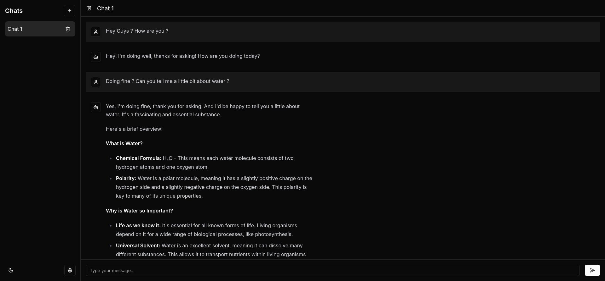
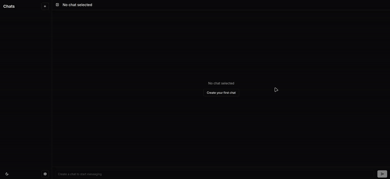

# Next.js AI Chatbot

A modern, responsive AI chatbot built with Next.js, featuring real-time responses and conversation history management.

<div align="center">
  
</div>

## Features

- 💬 Real-time AI chat interface
- 📱 Responsive design with collapsible sidebar
- 📝 Chat history management
- 🔄 Loading states and error handling
- 🎨 Sleek UI using Tailwind CSS and Shadcn UI components

## Demo Video

<div align="center">
  <video width="80%" style="max-width: 800px; border-radius: 8px; box-shadow: 0 4px 8px rgba(0,0,0,0.1);" controls>
    <source src="public/demo_chatbot.mp4" type="video/mp4">
    Your browser does not support the video tag.
  </video>
</div>

<details>
<summary>💡 Can't see the video? Click here for a GIF alternative</summary>
<div align="center">
  
</div>
</details>

## Technologies Used

- **Frontend**: Next.js, React, TypeScript
- **Styling**: Tailwind CSS, Shadcn UI
- **State Management**: Custom hooks with React useState
- **Icons**: Lucide React

## Getting Started

### Prerequisites

- Node.js 18 or later
- npm or yarn

### Installation

1. Clone the repository:

```bash
git clone https://github.com/phlearning/nextjs-chatbot.git
cd nextjs-chatbot
```

2. Install dependencies:

```bash
npm install
# or
yarn install
```

3. Create a `.env` file in the project root and add your API key (or modify the .env.example into .env and adjust with your key):

```env
GEMINI_API_KEY=your_gemini_api_key_here
```

### Running the Application

To start the development server, run:

```bash
npm run dev
# or
yarn dev
```

Open your browser and navigate to `http://localhost:3000` to see the application in action.

### Building for Production

To build the application for production, run:

```bash
npm run build
# or
yarn build
```

This will create an optimized production build in the `.next` directory.

To start the production server, run:

```bash
npm start
# or
yarn start
```

Make sure to set the necessary environment variables in your hosting environment.
